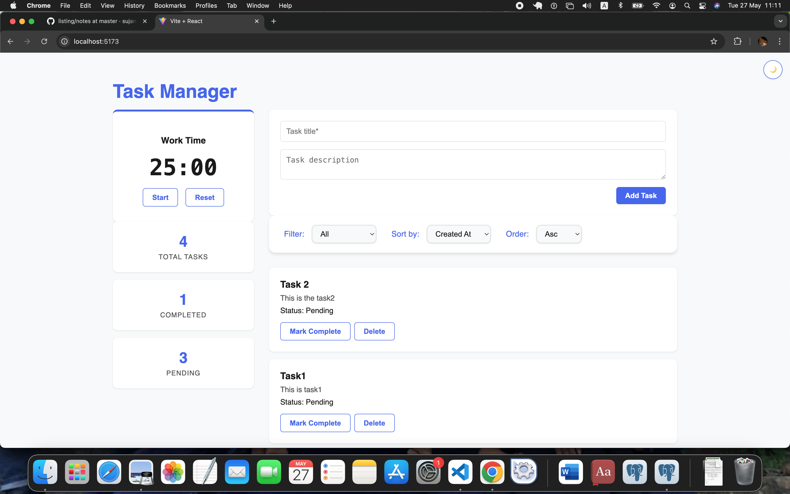

# Assignment 2

This repository contains the source code and documentation for Assignment 2.  
Assignment 2 is about developing a modern task manager with CRUD features, filtering, sorting, drag-and-drop reordering, and a Pomodoro timer.

## Project Structure

- `src/` - Source code files
  - `components/` - React components (TaskList, TaskInput, Timer, ThemeToggle, etc.)
  - `context/` - Context providers (TaskContext)
  - `hooks/` - Custom hooks (useLocalStorage, usePomodoroTimer)
  - `App.css` - Main styling
- `README.md` - Project documentation

## Getting Started

1. **Clone the repository:**
    ```bash
    git clone https://github.com/sujan-thapa/assignment2.git
    cd assignment2
    ```

2. **Install dependencies:**
    ```bash
    npm install
    ```

3. **Run the project:**
    ```bash
    npm run dev
    ```

## Usage

After starting the dev server, open your browser and navigate to [http://localhost:5173/](http://localhost:5173/).

## Features

- **CRUD Tasks:** Add, update, delete, and toggle completion status of tasks.
- **Filtering & Sorting:** Filter tasks by status (all, completed, pending) and sort by creation date or title (ascending/descending).
- **Drag-and-Drop:** Reorder tasks via drag-and-drop (desktop).
- **Pomodoro Timer:** Built-in timer for productivity.
- **Theme Toggle:** Switch between light and dark mode.
- **Persistent Storage:** All tasks are saved in localStorage.
- **Responsive Design:** Works well on desktop and mobile.

## Usage of React Hooks

This project makes extensive use of React hooks:

- `useState` – For managing local component state (e.g., form inputs, filters, theme).
- `useEffect` – For side effects (e.g., syncing theme, timers, localStorage).
- `useReducer` – For timer state and per-task timer logic.
- `useMemo` – For efficient filtering and sorting of tasks.
- `useCallback` – For stable drag-and-drop handlers.
- `useRef` – For timer intervals and DOM references (e.g., auto-scrolling).
- `useLayoutEffect` – For scrolling to the latest task after render.
- **Custom Hooks:**
  - `useLocalStorage` – Persist tasks in localStorage.
  - `usePomodoroTimer` – Manage Pomodoro timer logic.

## How to Reorder Tasks

- Drag a task and drop it onto another task to change its order.  
- The new order is saved automatically.

## Theming

- Click the theme toggle button (🌙/☀️) in the top-right corner to switch between light and dark mode.  
- Your preference is saved for future visits.

---

Feel free to explore the code and extend the functionality!

## Screenshots of the Dashboard Interface
  - in light theme
- in dark theme


